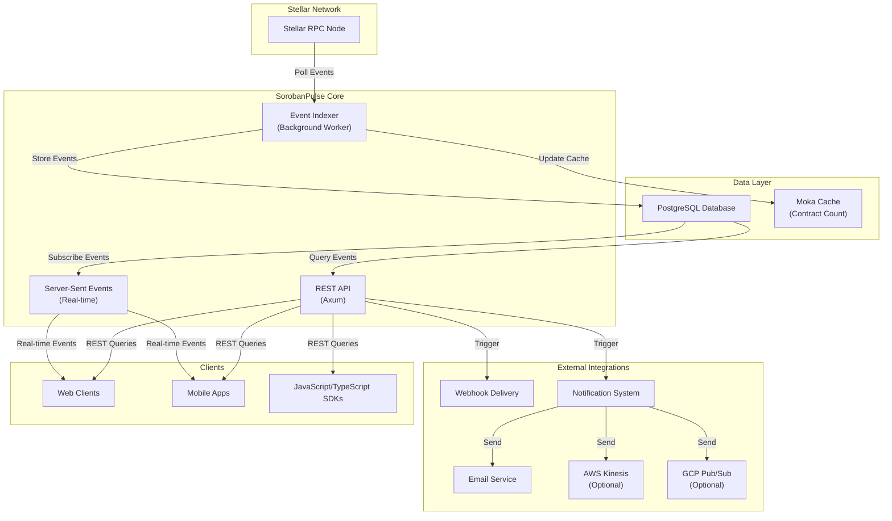
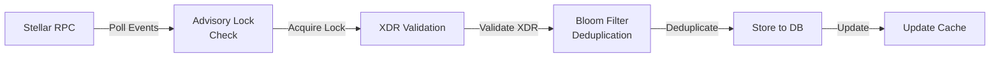
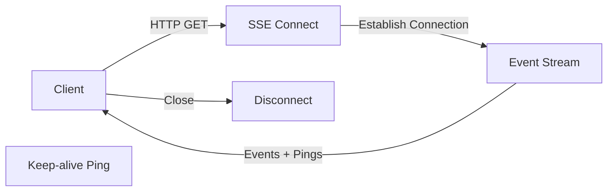
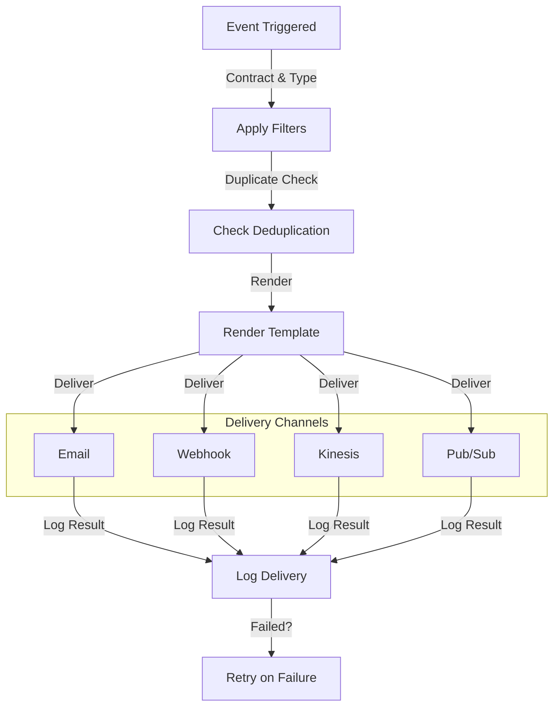
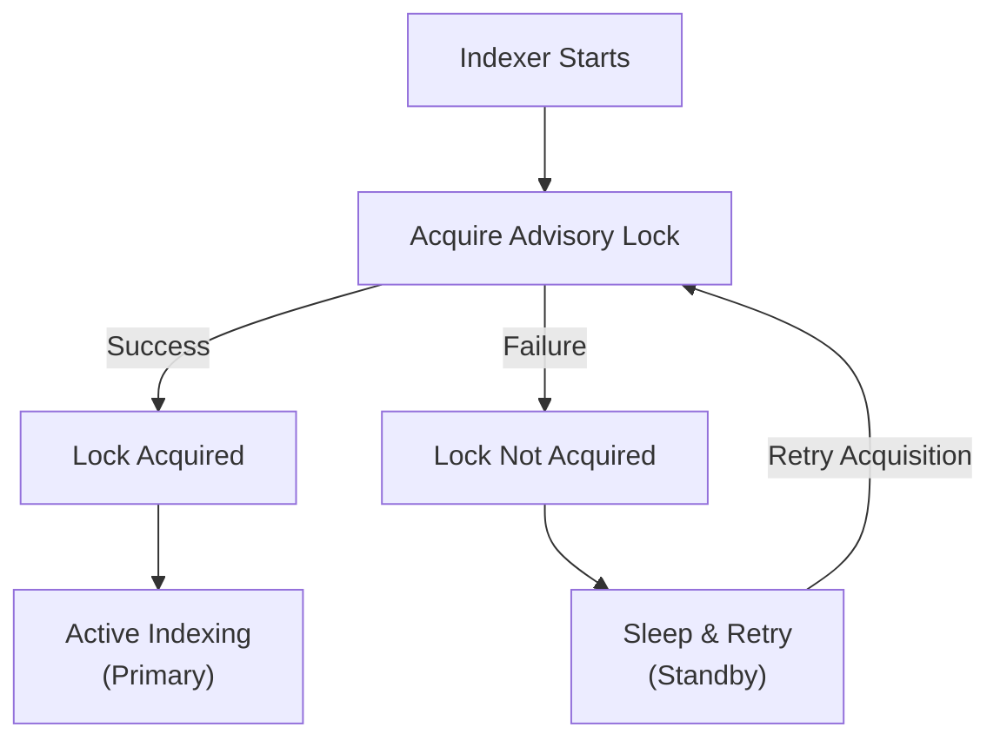
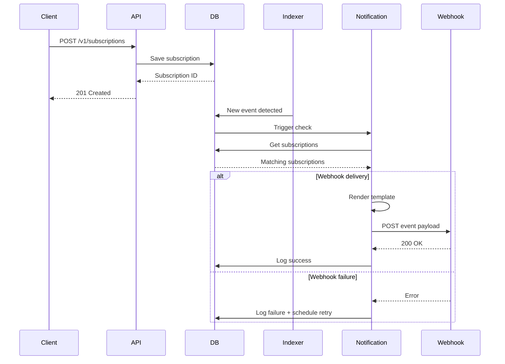
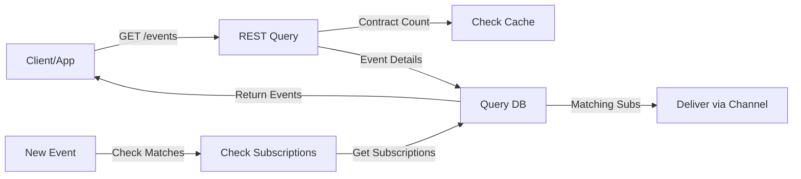

# System Architecture

This document provides a comprehensive overview of the SorobanPulse system architecture, including all components, data flows, and integrations.

## System Overview

SorobanPulse is a Soroban smart contract event indexing and notification system built on Stellar. The system consists of multiple interconnected components that work together to provide real-time event indexing, querying, and notifications.



## Component Architecture

### 1. Event Indexer

The Event Indexer is a background worker that continuously polls the Stellar RPC node for new Soroban smart contract events.

**Responsibilities:**
- Poll Stellar RPC at configurable intervals
- Detect new events since the last indexed ledger
- Parse and validate XDR (External Data Representation) events
- Store events in PostgreSQL with metadata
- Update in-memory contract count cache
- Implement advisory lock mechanism for multi-replica deployments
- Handle ledger gaps and recovery scenarios
- Emit metrics for monitoring

**Key Features:**
- **Multi-replica support**: Uses PostgreSQL advisory locks to ensure only one indexer instance runs at a time
- **Bloom filter deduplication**: Prevents processing duplicate events
- **XDR validation**: Validates all events against Stellar's XDR schema
- **Contract caching**: Maintains in-memory cache of contract event counts
- **Graceful shutdown**: Properly releases advisory locks on termination



### 2. REST API

The REST API provides HTTP endpoints for querying events, managing subscriptions, and triggering webhooks and notifications.

**Key Endpoints:**
- `GET /v1/events` - List events with pagination, filtering, and sorting
- `POST /v1/subscriptions` - Create webhook subscriptions
- `GET /v1/subscriptions` - List active subscriptions
- `DELETE /v1/subscriptions/{id}` - Remove subscription
- `POST /v1/notifications` - Create notification preferences
- `GET /health` - Health check endpoint
- `GET /v1/admin/*` - Administrative endpoints (requires auth)

**Features:**
- OpenAPI 3.0 documentation (auto-generated via Utoipa)
- Request/response validation
- Pagination with cursor support
- Comprehensive error responses
- Rate limiting (configurable per IP)
- API key authentication (optional)
- CORS support for cross-origin requests

### 3. Server-Sent Events (SSE)

Real-time event streaming to connected clients using HTTP Server-Sent Events.

**Features:**
- Long-lived HTTP connections
- Keep-alive pings to prevent connection timeout
- Per-IP connection tracking (DashMap)
- Graceful reconnection support
- Event filtering by contract/event type
- Backpressure handling



### 4. Database Layer

PostgreSQL database with structured schema for events, subscriptions, and metrics.

**Key Tables:**
- `events` - Smart contract events with XDR, ledger info, contract details
- `subscriptions` - Webhook subscriptions with event filters
- `notification_preferences` - User/account notification settings
- `notification_logs` - History of sent notifications
- `webhook_deliveries` - Webhook delivery tracking and retry logs
- `metrics` - Performance and operational metrics

**Indexes:**
- Compound indexes on (contract_id, created_at) for efficient event filtering
- Indexes on subscription filters for fast lookups
- Partial indexes on active subscriptions
- B-tree indexes on frequently queried columns

**Optimizations:**
- JSONB columns for flexible event metadata storage
- Partitioning by date for large tables (optional)
- Connection pooling via SQLx with configurable pool size
- Prepared statements for security and performance

### 5. Notification System

Flexible notification delivery system supporting multiple channels.

**Supported Channels:**
- Email notifications (via Lettre SMTP)
- Webhook deliveries (with retry logic)
- AWS Kinesis streaming (optional, behind `kinesis` feature)
- GCP Pub/Sub (optional, behind `pubsub` feature)

**Features:**
- **Template system**: Handlebars templates for multi-language support
- **Content filtering**: Filter events based on contract address, event type, attributes
- **Rate limiting**: Token bucket algorithm for per-channel throttling
- **Deduplication**: Prevents sending duplicate notifications
- **Retry logic**: Exponential backoff with configurable max retries
- **Delivery tracking**: Logs all notification attempts with status



### 6. Multi-Replica Advisory Lock Mechanism

For high-availability deployments, SorobanPulse uses PostgreSQL advisory locks to ensure only one indexer instance is actively polling events.

**How it works:**
1. On startup, the indexer attempts to acquire a global advisory lock (key: `LOCK_ID`)
2. **Primary indexer**: If lock acquired, begins normal operation
3. **Standby indexer(s)**: If lock not acquired, enters sleep loop with periodic retry
4. **Leadership change**: When primary shuts down, standby acquires lock and becomes primary
5. **Lock timeout**: Configurable timeout prevents deadlock in case of unexpected termination

**Benefits:**
- Single writer pattern prevents concurrent indexing
- Automatic failover without external coordinator
- No data corruption or race conditions
- Simple, battle-tested PostgreSQL feature



### 7. Subscription and Webhook Delivery Flow



## Technology Stack

### Core Technologies
- **Language**: Rust (2021 edition)
- **Web Framework**: Axum 0.8+
- **Async Runtime**: Tokio
- **Database**: PostgreSQL 14+
- **Database Driver**: SQLx with compile-time query verification
- **JSON**: Serde + Serde JSON
- **Serialization**: Serde YAML

### Stellar Integration
- **Stellar XDR**: stellar-xdr crate for event validation
- **HTTP Client**: Reqwest (async)

### Additional Libraries
- **Tracing**: Distributed tracing with tracing and tracing-subscriber
- **OpenTelemetry**: Optional OTLP and Zipkin exporters
- **Rate Limiting**: Tower Governor (per-IP) + Governor (token bucket)
- **Caching**: Moka (async-aware, feature-rich)
- **Deduplication**: Bloomfilter
- **Cryptography**: SHA2, HMAC, AES-GCM, Base64, Hex
- **Templating**: Handlebars for email templates
- **Scheduling**: Cron expressions for custom schedules
- **Secrets**: Secrecy for secure secret handling

### Optional Features
- **OpenTelemetry**: `otel` feature for OTLP tracing
- **Zipkin**: `zipkin` feature for distributed tracing
- **Encryption**: `encryption` feature for payload encryption
- **AWS Kinesis**: `kinesis` feature for streaming
- **GCP Pub/Sub**: `pubsub` feature for streaming
- **Lua Scripting**: `lua` feature for event transformation

## Data Flow

### Event Ingestion Flow

```mermaid
graph LR
    RPC["Stellar RPC Node"]
    Poll["Poll for Events"]
    Validate["Validate XDR"]
    Dedup["Deduplication<br/>Filter"]
    Parse["Parse Event"]
    Enrich["Enrich Metadata"]
    Store["Store in DB"]
    Emit["Emit to SSE Clients"]
    
    RPC -->|getLedgerEvents| Poll
    Poll -->|Raw XDR| Validate
    Validate -->|Valid| Dedup
    Dedup -->|New Event| Parse
    Parse -->|Structured Data| Enrich
    Enrich -->|With Indices| Store
    Store -->|Notify| Emit
```



### Query and Notification Flow



## Deployment Architecture

### Single Instance
```
┌─────────────────────────────────────────┐
│         SorobanPulse Container          │
│  ┌─────────────────────────────────┐    │
│  │      Axum REST API + SSE        │    │
│  └─────────────────────────────────┘    │
│  ┌─────────────────────────────────┐    │
│  │      Tokio Event Indexer        │    │
│  └─────────────────────────────────┘    │
└─────────────────────────────────────────┘
         ↓                           ↑
    PostgreSQL Database
```

### High Availability (Multi-Replica)
```
┌──────────────────┐  ┌──────────────────┐  ┌──────────────────┐
│  Instance 1      │  │  Instance 2      │  │  Instance 3      │
│  (Primary)       │  │  (Standby)       │  │  (Standby)       │
│  Indexing + API  │  │  API Only        │  │  API Only        │
└──────────────────┘  └──────────────────┘  └──────────────────┘
         │                    │                    │
         └────────┬───────────┴───────────────────┘
                  ↓
         PostgreSQL (Replicated)
         with Advisory Locks
```

### Kubernetes Deployment
Configured via Helm charts in `/helm` directory with:
- StatefulSets for state management
- Service for load balancing
- Ingress for HTTP routing
- ConfigMaps for configuration
- Secrets for credentials
- PersistentVolumes for data

## Security Features

- **API Key Authentication**: Optional key-based auth for endpoints
- **Admin Key Separation**: Independent key for admin endpoints
- **Rate Limiting**: Per-IP request limiting
- **XDR Validation**: All events validated against Stellar schema
- **Secret Zeroization**: Sensitive data cleared from memory
- **HTTPS/TLS**: Transport security
- **CORS**: Cross-origin request control
- **Webhook Verification**: HMAC signature verification for webhooks

## Monitoring and Observability

### Metrics
- Indexed events count
- API request latency and count
- Active SSE connections
- Database query performance
- Queue depths for notifications
- Cache hit rates

### Logging
- Structured JSON logging (optional)
- Log levels configurable per module
- Request tracing via unique IDs
- Distributed tracing via OpenTelemetry

### Health Checks
- `/health` endpoint for liveness probe
- `/healthz/ready` for readiness probe
- Database connectivity checks
- Indexer lag monitoring

## Performance Optimizations

1. **Connection Pooling**: SQLx with configurable pool size
2. **Query Caching**: Moka cache for frequent lookups
3. **Prepared Statements**: SqlX compile-time verification
4. **Bloom Filters**: O(1) deduplication checking
5. **Pagination**: Cursor-based to prevent offset scanning
6. **Compression**: Gzip support for response bodies
7. **Indexing**: Strategic database indexes on hot paths
8. **Async/Await**: Non-blocking I/O throughout
9. **Connection Pooling**: Per-IP SSE tracking with DashMap

## Future Enhancements

- Event archival to cloud storage (S3, GCS)
- Real-time dashboard for monitoring
- Advanced event search with full-text indexing
- GraphQL API option
- Event replay from archive
- Custom event transformation (Lua scripting)
- Machine learning for anomaly detection
